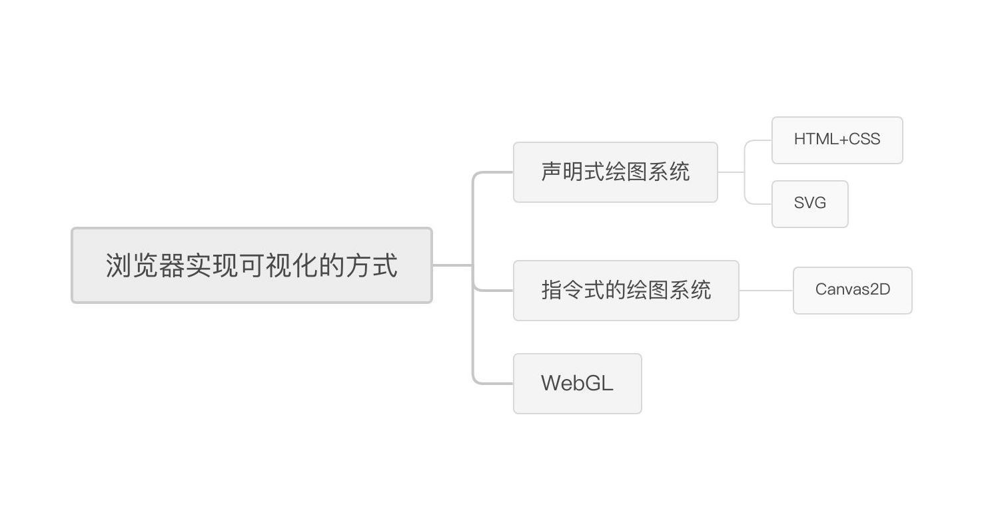

# example

项目实例代码

## [canvas 坐标](./canvas/base/example01.html)

## [箭头跟随鼠标箭头移动](./canvas/base/example02.html)

## [利用 Canvas 实现图像处理](./filters/index.html)

> 灰度，马赛克，饱和度等等，并不完善，仅是 demo 而已，不过关键算法都可以看到；
> 
> 之后会考虑实现这个库
>

## [爱心](./blog/heart.html)

----

# 跟着月影学可视化
>极客时间《跟着月影学可视化》中的例子源码，以及课后习题
>
## 图形基础篇
> 带你熟悉HTML/CSS、SVG、Canvas2D和WebGL这四种图形系统，学会它们的基本用法、优点和局限性，从而能在实际应用中选择合适的图形系统，以达到最好的视觉效果。
> 
### 01、浏览器中实现可视化的四种方式

#### <u>[用HTML和CSS来实现可视化](./visualization/图形基础篇/01、浏览器中实现可视化的四种方式/html-css.html)</u>

#### <u>[用SVG来实现可视化](./visualization/图形基础篇/01、浏览器中实现可视化的四种方式/svg.html)</u>

### 02、指令式绘图系统：如何用Canvas绘制层次关系图？
#### <u>[城市层级源码](./visualization/图形基础篇/02、指令式绘图系统：如何用Canvas绘制层次关系图？/hierarchy.html)</u> 
#### <u>[在画布中心绘制图形](./visualization/图形基础篇/02、指令式绘图系统：如何用Canvas绘制层次关系图？/shape/)</u> 

## 数学基础篇
> 深入讲解向量、矩阵运算、参数方程、三角剖分以及仿射变换等内容，并配合综合运用，帮你建立一套通用的数学知识体系，适用于所有图形系统，以此来解决可视化图形呈现中的大部分问题。
> 

## 视觉呈现篇
>和你讨论像素化、动画、3D和交互等话题，结合美颜、图片处理和视觉特效等实际例子，来应用各种数学和图形学知识，帮你全面提升视觉呈现的能力，实现更高级的视觉效果。
>

## 性能优化
>通过学习WebGL渲染复杂的2D、3D模型的方法，了解可视化高性能渲染的技术思路。在这一模块月影将和你分享他总结的一些成熟的方法论，帮助你在实现可视化项目的时候，解决大规模数据批量渲染的性能瓶颈问题。
>

## 数据驱动
>结合3D柱状图、3D层级结构图、3D音乐可视化等案例，讲解数据处理的技巧，真正正将数据和视觉呈现结合起来，实现具有科技感的3D可视化大屏效果，最终形成完整的可视化解决方案。
>
